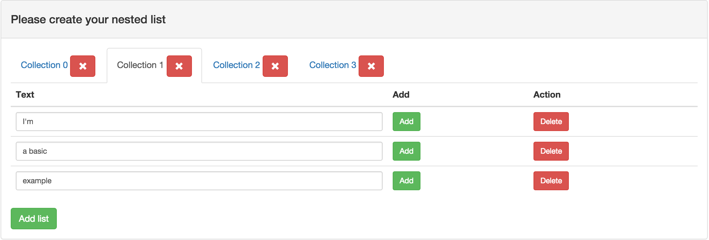

# Javascript to handle Symfony form collections

## Goal

The aim of [collection.js](src/collection.js) is to provide the
minimum javascript code to handle the
[form collection](http://symfony.com/doc/current/reference/forms/types/collection.html)
of symfony.  I strongly advise you to do it yourself at least once by
following the
[cookbook](http://symfony.com/doc/current/cookbook/form/form_collections.html).

This work relies on [jQuery](https://jquery.com/).

## Presentation

This repository only aims at presenting
[collection.js](src/collection.js). There are two examples.

[simple.html](example/view/simple.html) is an example of were you
should use [collection.js](src/collection.js). With no extra code you
get a working form collection based on your symfony template.

[complex.html](example/view/complex.html) is not necessarily a case
were you should use [collection.js](src/collection.js). As there are
lot of specific behaviors, there is no real need for an external
part. However it exists to present how you can add your specific
behaviors on top of [collection.js](src/collection.js).

## Try it

To try it on your computer please read [this](doc/tryIt.md).
For more information please read the [doc](doc/howTo.md).
